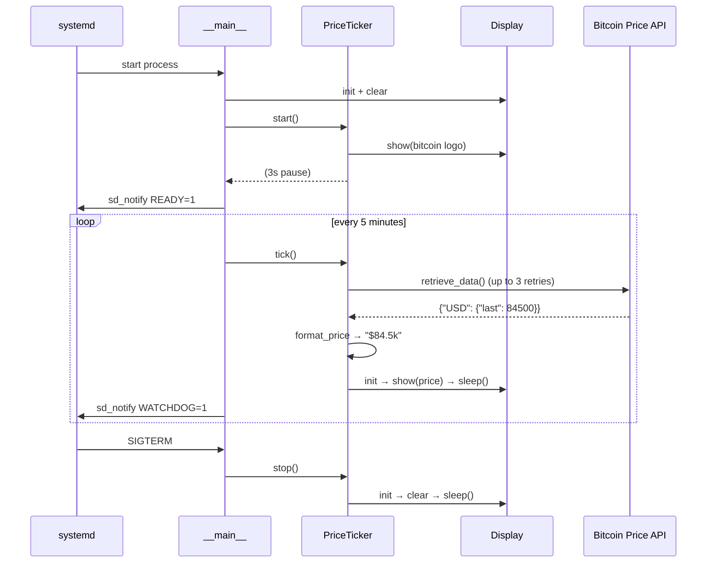

# E-Paper Bitcoin Price Ticker


[](https://sonarcloud.io/project/overview?id=janrothen_e-paper)
[](https://sonarcloud.io/project/overview?id=janrothen_e-paper)
[](https://sonarcloud.io/project/overview?id=janrothen_e-paper)
[](https://sonarcloud.io/project/overview?id=janrothen_e-paper)
[](https://sonarcloud.io/project/overview?id=janrothen_e-paper)

Displays the current Bitcoin/USD price on a Waveshare 2.13" e-ink display (epd2in13 V2) connected to a Raspberry Pi. On startup it shows a Bitcoin logo, then enters a loop that refreshes the price every 5 minutes. The background alternates randomly between black and white on each refresh.

## Requirements

**Hardware**
- Raspberry Pi (tested on Pi 4 Model B Rev 1.4)
- Waveshare 2.13" e-ink display (epd2in13 V2)

**Software**
- Python 3.13+
- pip dependencies: `requests`, `Pillow` (see `pyproject.toml`)
- Raspberry Pi extras: `RPi.GPIO`, `spidev`, `pigpio`, `gpiozero`, `numpy`, `waveshare-epd` (installed via `pip install -e ".[rpi]"`)

## Architecture

### Runtime sequence



## Configuration

All settings live in `config.toml` — there are no secrets or `.env` files required.

```toml
[bitcoin.price]
service_endpoint = "https://blockchain.info/ticker"
currency = "USD"   # currency code returned by the API (e.g. "CHF", "EUR")
symbol = "$"       # symbol shown on the display (e.g. "CHF ", "€")
refresh_interval = 300  # seconds between price refreshes
```

**To display a different currency**, set `currency` to any code the API returns and `symbol` to the label you want shown on screen. For example, to show Swiss francs:

```toml
currency = "CHF"
symbol = "CHF "
```

The `service_endpoint` must return JSON in this shape (the [blockchain.info ticker](https://blockchain.info/ticker) is the default):

```json
{
  "USD": { "last": 84500.0 },
  "CHF": { "last": 75000.0 }
}
```

Any endpoint that returns this structure works as a drop-in replacement.

## Install & run

```bash
python3 -m venv .venv
source .venv/bin/activate
pip install -e ".[rpi]"
python -m epaper
```

If you get permission errors on SPI/GPIO devices, add your user to the required groups (then log out and back in):

```bash
sudo usermod -aG spi,gpio $USER
```

## Development

```bash
python3 -m venv .venv
source .venv/bin/activate
pip install -e ".[dev]"
pytest
```

The mock price client (`src/epaper/price/mock.py`) is used automatically during tests so no live API or hardware is required to run the test suite.

## Deployment

Run as a systemd service for auto-start on boot and auto-restart on failure.

Open `systemd/epaper.service` and adjust `User`, `WorkingDirectory`, and `ExecStart` to match your username and install path before copying it.

```bash
# Install the service unit
sudo cp systemd/epaper.service /etc/systemd/system/
sudo systemctl daemon-reload

# Enable (start on boot) and start immediately
sudo systemctl enable --now epaper

# Check status / logs
systemctl status epaper
journalctl -u epaper -f
```

To stop and disable auto-start:

```bash
sudo systemctl disable --now epaper
```

## Troubleshooting

| Symptom | Likely cause |
|---|---|
| `ModuleNotFoundError: No module named 'RPi'` | RPi extras not installed — run `pip install -e ".[rpi]"` |
| `PermissionError` on `/dev/spidev` or `/dev/gpiomem` | User not in `spi`/`gpio` groups — run `sudo usermod -aG spi,gpio $USER` and re-login |
| Display stays blank after start | SPI not enabled — run `sudo raspi-config` → Interface Options → SPI → Enable |
| Price shows as `$0` or `N/A` | API unreachable — check network and `service_endpoint` in `config.toml` |
| Service fails to start with `sd_notify` errors | `Type=notify` in the unit file requires systemd watchdog support; verify the unit matches `systemd/epaper.service` |
| `waveshare_epd` import fails | Package installed from wrong commit — reinstall with `pip install -e ".[rpi]"` |

## Contributing

Found a bug or have an idea? Open an issue or send a PR.
Run `pytest` before submitting and keep changes focused.

## License

MIT © Jan Rothen — see [LICENSE](LICENSE) for details.
